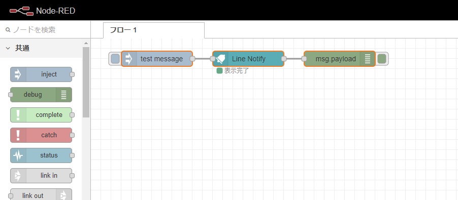
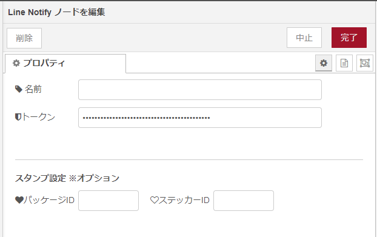

# node-red-contrib-line-notify-api

A Node-RED node for sending to line notifications.



## Pre-requisites

The node-red-contrib-line-notify-api requires `Node-RED 1.00` to be installed.

## Install

This `node-red-contrib-line-notify-api` is implemented according to the `line notify` specification.

```cmd
npm install node-red-contrib-line-notify-api
```

## Usage

- Properties

  

  - Name

    Set the node name displayed in the flow.

  - Token

    Please set the token issued by Line Developers.

    See the LINE Notify API Document for more details.

    [LINE Notify API Document](https://notify-bot.line.me/doc/ja/)

  - sticker

    Set this setting to "If you want to add a stamp to the message".

    [List of available stickers](https://developers.line.biz/en/docs/messaging-api/sticker-list/)

- Inputs

    1) message `*required`

        The line notification message is passed by msg.payload or msg.message.

        ```json
        msg.payload = "line notification message.";
        ```

        or

        ```json
        msg.message = "line notification message."; /* This `msg.message` is given priority. */
        ```

    2) sticker `*optional`

        This `sticker` can send additional stamp messages.

        The function is enabled by setting numerical values for `stickerPackageId` and `stickerId`.

        [List of available stickers](https://developers.line.biz/en/docs/messaging-api/sticker-list/)

        ```json
        msg.stickerPackageId = 446; /* Package ID. */
        msg.stickerId = 1990;       /* Sticker ID. */
        ```

- Outputs

    The processing result is passed by msg.payload. It consists of an object that contains the following properties:

    ```javascript
    export interface AxiosResponse<T = any>  {
        data: T;
        status: number;
        statusText: string;
        headers: any;
        config: AxiosRequestConfig;
        request?: any;
    }
    ```

    msg.payload : Object

    ```cmd
    {"status":200,"message":"ok"}
    ```

## npm-scripts

There are some npm-scripts to help developments.

- npm install - Install the testing environment in your project.
- npm run build - Make `./data/my-node` directory from the `src` directory and Install the my-node in Node-RED.
- npm run start - Start Node-RED. `"http://localhost:1880"`

## file list

  ```json
  [root]
  │  package.json
  │  README.md
  │  tsconfig.json
  │
  ├─data -> `Node-Red work files`
  │  │  
  │  ├─my-node -> `project files` The resource files and built files should be placed here.
  │  │  │  package.json
  │  │  │
  │  │  └─nodes -> The resource files and built files should be placed here.
  │  │     └─...
  │  │
  │  └─node_modules
  │     └─...
  │
  ├─dist -> `The project built files`
  ├─examples -> `node-RED flow files`
  ├─figs
  └─src
      └─nodes -> project files
          ├─icons
          ├─lib
          ├─locales
          │  ├─en-US
          │  └─ja
          └─test
  ```
